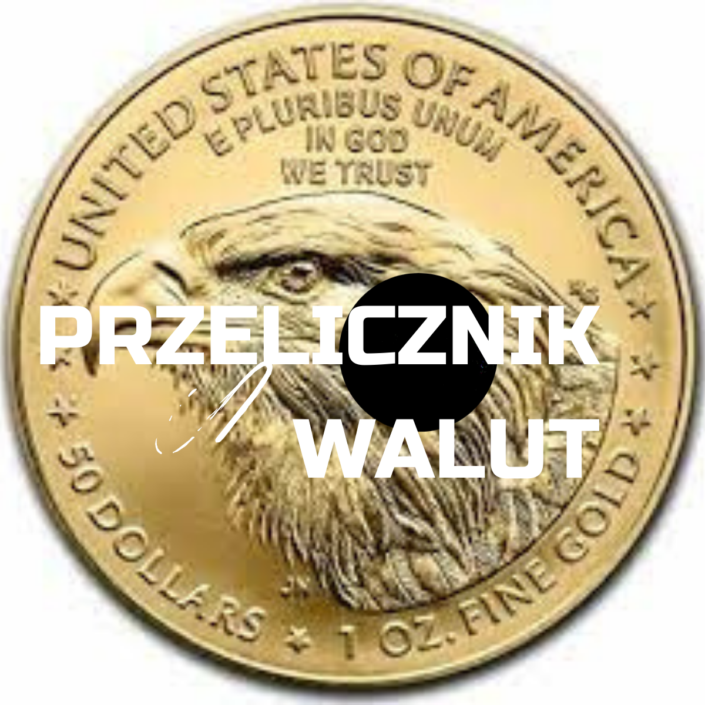

# Kalkulator walut w React

**A practical application with which you can check the current zloty exchange rates in the most popular currencies.**

This project was bootstrapped with [Create React App](https://github.com/facebook/create-react-app).

Technologies:
1. HTML
2. CSS
3. JavaScript
4. React
5. Styled-components
6. Custom Hooks

## Demo
[View the application](https://orangeblue342.github.io/Currency-converter-2-react/)

## Available Scripts

In the project directory, you can run:

See the section about [deployment](https://facebook.github.io/create-react-app/docs/deployment) for more information.

### Deployment

This section has moved here: [https://facebook.github.io/create-react-app/docs/deployment](https://facebook.github.io/create-react-app/docs/deployment)